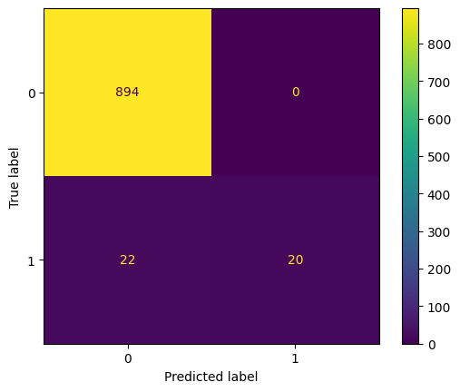
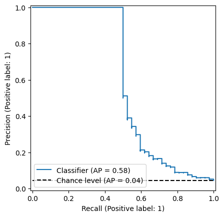

# Tox21 CLassification Neural Network From Scratch
These models utilize data from the [Tox21](https://tripod.nih.gov/tox21/challenge/data.jsp#) public dataset.

## Single Neuron Model
This is a simple logistic regression model with an output layer.

## Multi-layer Model
This model utilizes a hidden layer and output layer to extrapolate more patterns from the data.  

Some techniques used in the model include:
- Xavier Initialization
- Weighted binary cross-entropy loss
- Gradient clipping by norm
- Learning rate warm-up

    

***The  multi-layer model is able to acheive an F1  > 0.6  and PRC-AUC > 0.5 on unseen test data:***

