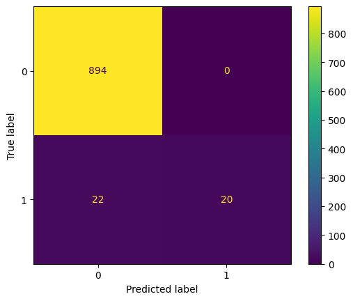

# Tox21 Classification Neural Network From Scratch
This project implements a fully vectorized two-layer neural network from scratch using only `NumPy` to classify chemical compounds based on their molecular fingerprints and activity label.

These models utilize data from the [Tox21](https://tripod.nih.gov/tox21/challenge/data.jsp#) public dataset.

## Key Features
Some techniques used in the model include:
- Fully vectorized forward and backward pass
- Hidden layer with ReLU activation
- Sigmoid output for binary classification
- Weighted binary cross-entropy loss to handle class imbalance
- Gradient clipping to prevent exploding gradients
- Learning rate warm-up for stable early training
- Validation loss tracking and best model saving
- Clean loss visualizations (train vs val) using `seaborn`
- Confusion matrices and precision-recall curves for model evaluation with imbalanced classes


## Project Organization
```bash
├── README.md                # Project description, setup, usage, future work
├── requirements.txt         # Required Python packages
├── train.py                 # Main training loop (data loading, training, evaluation)
├── model.py                 # NeuralNet class
├── utils.py                 # Helper functions (relu, sigmoid, loss, gradient clipping, etc.)      
├── example_use.ipynb        # Notebook showing example use of NeuralNet class
├── plots/
│   └── training_loss.png    # Plot of training loss over epochs
│   └── validation_loss.png  # Plot of validation loss over epochs
├── notebooks/
│   └── single_neuron_model.ipynb # Notebook showing a single-neuron (logistic regression) model
│   └── single_neuron_funcs.py # Functions for single-neuron model
│   └── multi_layer_model.ipynb # Notebook showing a multi-layer model
│   └── multi_layer_funcs.py # Functions for multi-layer model
```

## Model Results
***The  multi-layer model is able to acheive an F1  > 0.6  and PRC-AUC > 0.5 on unseen test data (chance level = 0.04):***




